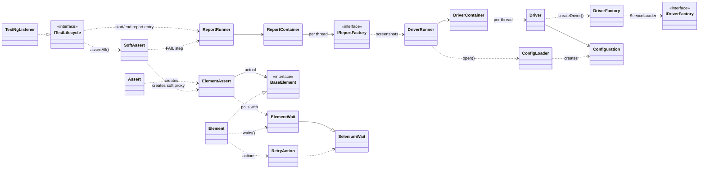
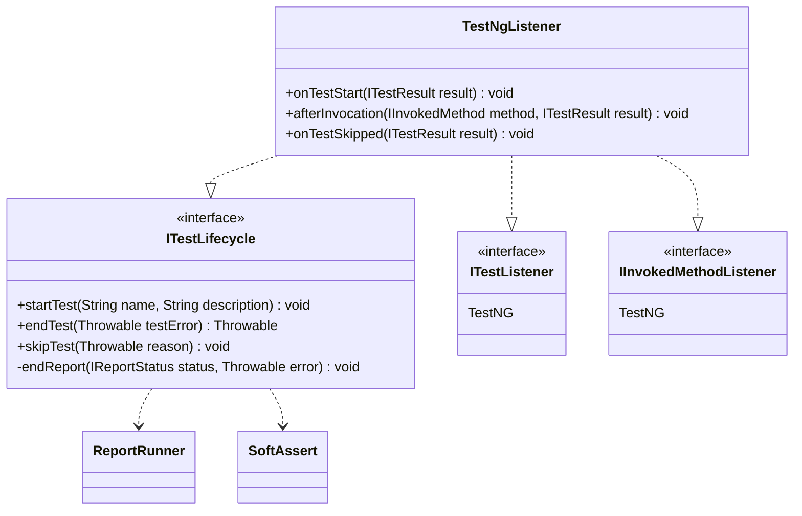
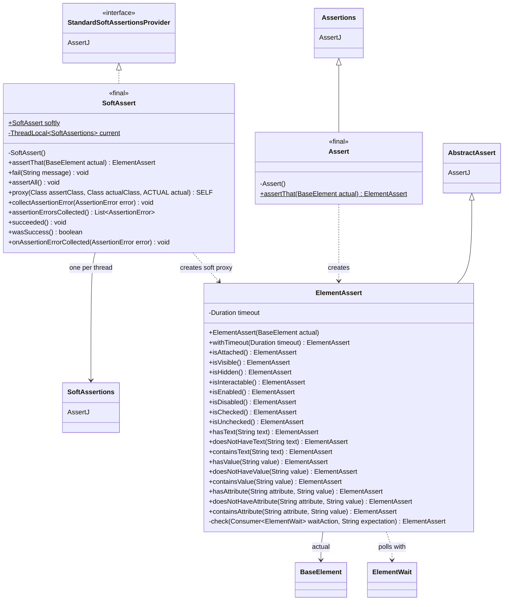
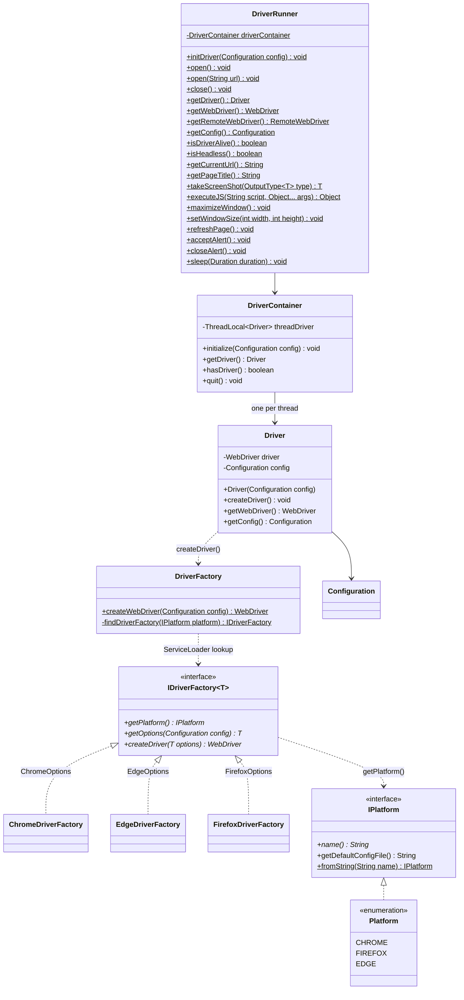
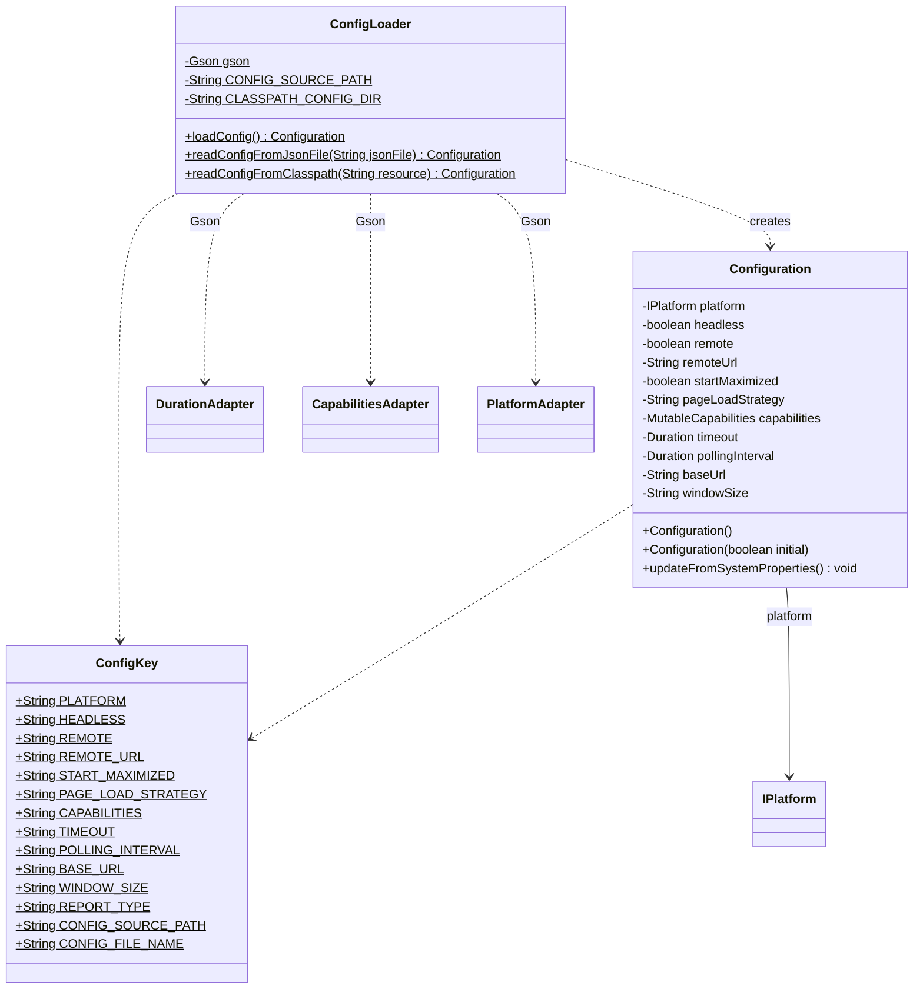
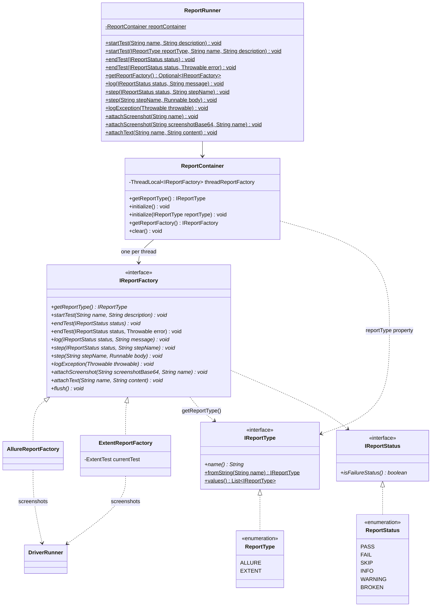

# Class Diagram

Class diagrams for the `SELE3` framework (`src/main/java/com/sele3`), written in
[Mermaid](https://mermaid.js.org/syntax/classDiagram.html).

- [Overview](#overview)
- [Lifecycle and listeners](#lifecycle-and-listeners)
- [Assertions](#assertions)
- [Elements and waits](#elements-and-waits)
- [Drivers](#drivers)
- [Configuration](#configuration)
- [Reports](#reports)

---

## Overview

How the packages fit together. Arrows point from the class that depends on another to the class it
depends on.

**Main flows**

- **Test lifecycle:** the test runner's adapter (`TestNgListener`) calls `ITestLifecycle`, which
  starts/ends the report entry through `ReportRunner` and checks soft assertions through
  `SoftAssert.softly.assertAll()`.
- **Browser:** `DriverRunner.open()` loads a `Configuration` with `ConfigLoader`, and
  `DriverContainer` keeps one `Driver` per thread. `Driver` asks `DriverFactory` for a `WebDriver`,
  which picks the `IDriverFactory` registered for the configured platform.
- **Reporting:** `ReportRunner` is the static API used by tests and the framework; `ReportContainer`
  keeps one `IReportFactory` (Allure or Extent) per thread.
- **Elements and assertions:** `Element` actions retry through `RetryAction`; element assertions
  (`ElementAssert`) poll through `ElementWait`.

---

## Lifecycle and listeners

Packages: `com.sele3.lifecycle`, `com.sele3.listeners`

| Method | Called when | Does |
|---|---|---|
| `startTest` | a test starts | starts the report entry (a reporter error is logged, not thrown) |
| `endTest` | the test body finished, while the result can still change | runs `softly.assertAll()`, ends the report entry as PASS/FAIL, returns the error the test should fail with (or `null`) |
| `skipTest` | a test is skipped | discards pending soft failures, ends the report entry as SKIP |

---

## Assertions

Package: `com.sele3.asserts`

- `Assert` inherits every AssertJ `assertThat(...)` and adds one for `BaseElement`.
- `SoftAssert.softly` is a single shared instance; each thread collects into its own
  `SoftAssertions`, and every collected failure is reported as a FAIL step.
- `ElementAssert.check` creates a new `ElementWait` per check. Only that wait expiring
  (`SeleniumWait.getExpiry()`) becomes an assertion failure; other exceptions are rethrown.

---

## Elements and waits

Packages: `com.sele3.elements`, `com.sele3.waits`

```mermaid
classDiagram
    class BaseElement {
        <<interface>>
        +set(Object... args)* void
        +getBy()* By
        +getAttribute(String attribute)* String
        +getText()* String
        +getInnerText()* String
        +getValue()* String
        +getCssValue(String name)* String
        +getAllCssValues(String name)* List~String~
        +getAllTexts()* List~String~
        +click()* void
        +rightClick()* void
        +doubleClick()* void
        +hover()* void
        +clickViaJS()* void
        +enter(CharSequence... values)* void
        +clearAndEnter(CharSequence... values)* void
        +select(String option)* void
        +selectByValue(String value)* void
        +selectByIndex(int index)* void
        +getSelectedOption()* String
        +getAllSelectedOptions()* List~String~
        +scrollToView()* void
        +scrollToCenter()* void
        +waits()* ElementWait
        +isEnabled()* boolean
        +isDisabled()* boolean
        +isSelected()* boolean
        +getSize()* int
    }

    class Element {
        #By locator
        #String dynamicXPathLocator
        +Element(By locator)
        +Element(String dynamicXPathLocator)
        #findElement() WebElement
        #findInteractableElement() WebElement
        #findElements() List~WebElement~
        #scrollToView(WebElement element) void
        #scrollToCenter(WebElement element) void
    }

    class WebDriverWait {
        Selenium
    }

    class SeleniumWait {
        -RuntimeException expiry
        +SeleniumWait()
        +SeleniumWait(Duration timeout, Duration pollingInterval)
        +getTimeout() Duration
        +withTimeout(Duration timeout) SeleniumWait
        +getExpiry() RuntimeException
        #timeoutException(String message, Throwable lastException) RuntimeException
        +untilPageToLoad() void
        +untilPageToLoadingAndComplete() void
        +untilJQueryToLoad() void
        +untilJQueryToProcessAndLoad() void
        +untilUrlContains(String text) void
    }

    class ElementWait {
        -BaseElement element
        +ElementWait(BaseElement element)
        +ElementWait(BaseElement element, Duration timeout, Duration pollingInterval)
        +withTimeout(Duration timeout) ElementWait
        +getElement() BaseElement
        +untilExist() void
        +untilAllExist() void
        +untilNotExist() void
        +untilVisible() void
        +untilAllVisible() void
        +untilInvisible() void
        +untilClickable() void
        +untilEnabled() void
        +untilDisabled() void
        +untilTextEquals(String text) void
        +untilTextNotEquals(String text) void
        +untilTextContains(String text) void
        +untilValueEquals(String value) void
        +untilValueNotEquals(String value) void
        +untilValueContains(String value) void
        +untilAttributeEquals(String attribute, String value) void
        +untilAttributeNotEquals(String attribute, String value) void
        +untilAttributeContains(String attribute, String value) void
        +untilSelectionStateToBe(boolean selected) void
        +untilChecked() void
        +untilUnchecked() void
        +untilElementsAreExactly(int expectedCount) void
        +untilElementsAreAtLeast(int expectedCount) void
    }

    class RetryAction {
        +retry(Supplier~T~ action, List exceptionsToIgnore)$ T
        +retry(Supplier~T~ action, List exceptionsToIgnore, Supplier~String~ description)$ T
        +retry(Runnable action, List exceptionsToIgnore)$ void
        +retry(Runnable action, List exceptionsToIgnore, Supplier~String~ description)$ void
        +readyCheck(T result)$ T
    }

    class RetryableExceptions {
        <<final>>
        +List COMMON_EXCEPTIONS$
        +List CLICK_EXCEPTIONS$
        +List SEND_KEYS_EXCEPTIONS$
    }

    BaseElement <|.. Element
    WebDriverWait <|-- SeleniumWait
    SeleniumWait <|-- ElementWait
    ElementWait --> BaseElement : element
    Element ..> ElementWait : waits()
    Element ..> RetryAction : every action
    Element ..> RetryableExceptions
    RetryAction ..> SeleniumWait
    ElementWait ..> RetryableExceptions
```

- `Element` implements every `BaseElement` method; each action/accessor runs through
  `RetryAction.retry(...)`, ignoring the matching `RetryableExceptions` list until the timeout.
- `SeleniumWait.timeoutException` records the wait's own expiry so callers can tell it apart from a
  `TimeoutException` thrown by a command inside the condition.

---

## Drivers

Package: `com.sele3.drivers`

- Browsers are discovered with `ServiceLoader` from
  `META-INF/services/com.sele3.drivers.IDriverFactory`. A new browser is a new `IDriverFactory`
  plus an `IPlatform`; no existing class changes.
- When `Configuration.remote` is `true`, `DriverFactory` creates a `RemoteWebDriver` from the
  factory's options instead of calling `createDriver`.
- `IPlatform.getDefaultConfigFile()` returns the lower-case platform name plus `.json`, used by
  `ConfigLoader` to pick the config file.

---

## Configuration

Packages: `com.sele3.configs`, `com.sele3.adapters`

- `ConfigLoader.loadConfig()` reads `<configSourcePath><file>` from disk, falls back to the
  framework's bundled `configs/<file>` on the classpath, then calls
  `Configuration.updateFromSystemProperties()` so `-D` properties override the file.
- The three adapters let Gson read `Duration` (milliseconds), `MutableCapabilities` (JSON object)
  and `IPlatform` (name) from JSON.

---

## Reports

Package: `com.sele3.reports`

- Reporters are discovered with `ServiceLoader` from
  `META-INF/services/com.sele3.reports.IReportFactory` and selected with `-DreportType`.
- All `ReportRunner` methods are no-ops when no report type is configured.
- Failure-status steps (`FAIL`, `WARNING`, `BROKEN`) and failing `step(name, body)` calls attach a
  screenshot; a screenshot failure is logged instead of replacing the original error.
